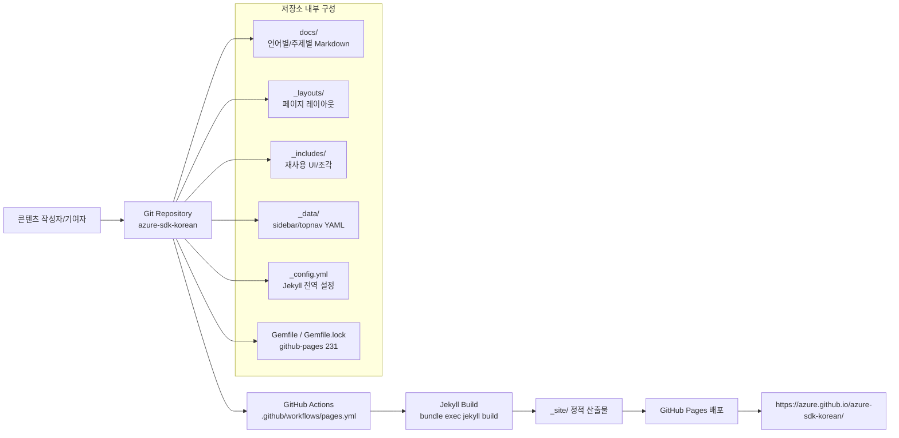
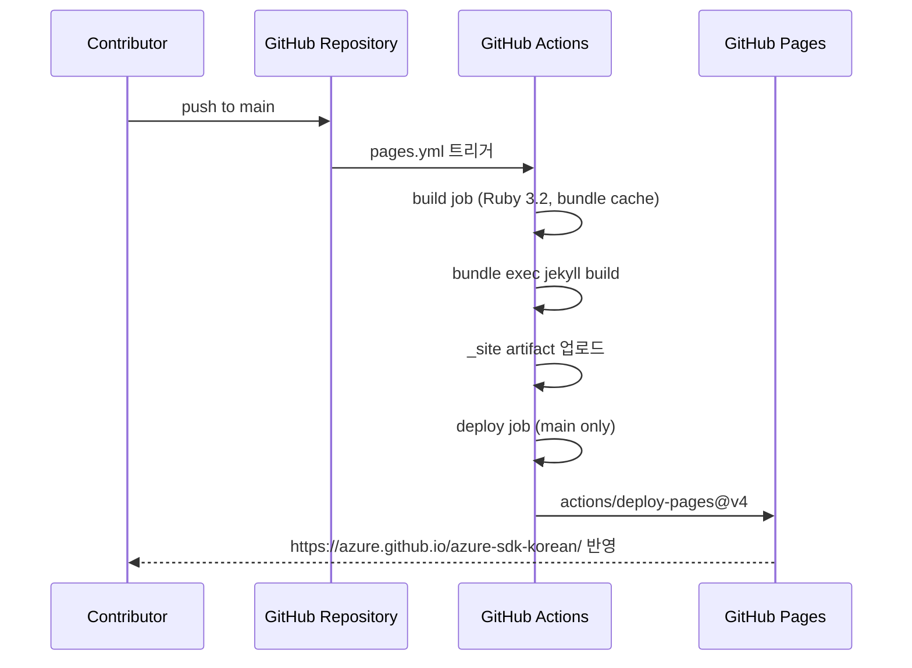

# azure-sdk-korean 아키텍처 문서 (ARCH)

본 문서는 `azure-sdk-korean` 저장소의 현재(2026-03 기준) 시스템 구조, 빌드/배포 파이프라인, 콘텐츠 조직 전략, 운영 의사결정(ADR)을 기록합니다.

## 1) 아키텍처 개요 (Architecture Overview)

`azure-sdk-korean`은 **Jekyll 기반 정적 문서 사이트**이며, 소스는 Markdown/YAML/HTML 템플릿으로 유지되고 GitHub Actions를 통해 GitHub Pages에 배포됩니다.

### 1.1 High-level System Diagram



### 1.2 Component Relationships

- 콘텐츠 소스: `docs/**.md`, `index.md`
- 렌더링 규칙: `_config.yml` (기본 `layout`, `sidebar`, `topnav`, `baseurl` 등)
- 내비게이션 데이터: `_data/sidebars/general_sidebar.yml`, `_data/topnav.yml`
- UI/페이지 조합: `_layouts/default.html`, `_layouts/page.html`, `_includes/sidebar.html`, `_includes/topnav.html`
- 빌드 정의: `Gemfile`( `github-pages ~> 231` ), `.github/workflows/pages.yml`

핵심 관계는 **Markdown 콘텐츠 + YAML 데이터 + Liquid 템플릿**의 결합입니다. 페이지는 front matter(예: `docs/general/introduction.md`)를 통해 permalink/사이드바를 선언하고, 레이아웃과 include가 이를 해석해 최종 HTML을 생성합니다.

---

## 2) Jekyll 빌드 플로우 (Jekyll Build Flow)

### 2.1 Source → Processing → Static Site

```mermaid
flowchart TD
    A[Source Files] --> A1[Markdown: docs/**/*.md, index.md]
    A --> A2[Templates: _layouts/*.html]
    A --> A3[Includes: _includes/**/*.html, _includes/**/*.md]
    A --> A4[Data: _data/**/*.yml]
    A --> A5[Config: _config.yml]

    A1 --> B[Jekyll + Liquid 엔진]
    A2 --> B
    A3 --> B
    A4 --> B
    A5 --> B

    B --> C[Markdown 변환: kramdown (GFM)]
    B --> D[Liquid 렌더링: layout/include/변수 치환]
    C --> E[_site/azure-sdk-korean/*]
    D --> E
```

### 2.2 Liquid 템플릿 / Markdown 처리

- Markdown 엔진: `_config.yml`의 `markdown: kramdown`, `kramdown.input: GFM`
- 기본 레이아웃 주입: `_config.yml > defaults`에서 페이지 기본 `layout: page`
- 레이아웃 체인:
  - `_layouts/page.html` → `layout: default`
  - `_layouts/default.html`에서 `topnav`, `sidebar`, 본문(content)을 조합
- include 시스템:
  - `index.md`가 ``, `` 호출
  - `_layouts/default.html`이 `topnav.html`, `sidebar.html`, `footer.html` 등 공통 조각 호출

### 2.3 Include System (`_includes/`)

`_includes/`는 공통 UI/문서 조각의 재사용 계층입니다.

- 내비게이션/구조: `sidebar.html`, `topnav.html`, `toc.html`
- 문서 보조: `note.html`, `warning.html`, `tip.html`, `important.html`
- 정보 블록: `info/header.md`, `refs.md`

이 구조는 페이지 중복을 줄이고 번역 문서 증가 시 유지보수 비용을 낮춥니다.

---

## 3) GitHub Pages 배포 프로세스 (GitHub Pages Deployment)

배포 정의는 `.github/workflows/pages.yml`에 있으며, **`gh-pages` 브랜치를 사용하지 않고** GitHub Pages 전용 Actions(`upload-pages-artifact`, `deploy-pages`)를 사용합니다.



### 3.1 파이프라인 핵심 포인트

- Trigger:
  - `push` on `main`
  - `pull_request` (빌드 검증)
- Build:
  - `ruby/setup-ruby@v1` + `bundler-cache`
  - `bundle exec jekyll build`
- Deploy:
  - `if: github.ref == 'refs/heads/main'`
  - `actions/deploy-pages@v4`

### 3.2 No `gh-pages` Branch

실제 브랜치 상태는 `main`만 운영하며(`git branch -a` 기준), 배포 산출물은 Actions artifact 기반으로 Pages에 게시됩니다.

---

## 4) 콘텐츠 구조 (Content Structure)

### 4.1 docs/ 조직

`docs/`는 언어/주제 단위로 분리됩니다.

- 언어: `docs/python/`, `docs/dotnet/`, `docs/java/`, `docs/android/`, `docs/ios/`
- 공통/정책: `docs/general/`, `docs/policies/`, `docs/contribution/`
- 기타: `docs/tables/`, `docs/tracing/`, `docs/redirects/`

각 문서는 front matter로 permalink와 sidebar를 선언합니다.

예: `docs/general/introduction.md`
- `permalink: general_introduction.html`
- `sidebar: general_sidebar`

### 4.2 Sidebar Navigation (`_data/`, `_config.yml`)

- `_config.yml`
  - `sidebars: [general_sidebar]`
  - defaults에서 `sidebar: general_sidebar`, `topnav: topnav`
- `_data/sidebars/general_sidebar.yml`
  - 문서 계층/메뉴 트리 선언
- `_data/topnav.yml`
  - 상단 메뉴 및 외부 링크 선언

`_includes/sidebar.html`은 `site.data.sidebars[page.sidebar]`를 읽어 렌더링하므로, 네비게이션 변경은 코드보다 **데이터(YAML)** 중심으로 관리됩니다.

### 4.3 Shared Includes / Layout System

- Shared includes: `_includes/` (헤더/푸터/경고/콜아웃/TOC)
- Layout system: `_layouts/default.html`, `_layouts/page.html`, `_layouts/post_redirect.html` 등

설계 방향은 “콘텐츠는 Markdown, 프레젠테이션은 Layout/Include” 분리입니다.

---

## 5) 업스트림 동기화 전략 (Upstream Sync Strategy)

본 프로젝트는 Azure SDK 원문 문서와 **완전 자동 동기화하지 않습니다.**

### 5.1 운영 방식

1. 업스트림 변경 탐지(수동)
2. 이슈 등록으로 작업 단위화
3. 번역/검수 후 반영

### 5.2 근거 이슈

- `#171`: General Guidelines > Implementation > Dependencies
- `#170`: General Guidelines > Implementation > Distributed Tracing
- `#169`: General Guidelines > Implementation > Parameter validation

### 5.3 왜 자동 동기화를 하지 않는가

- 번역은 의미 보존/용어 일관성 검토가 필수
- 원문과 1:1 텍스트 동기화보다 **품질 보증(Human Review)** 우선
- AGENTS.md의 운영 철학: “번역 품질 및 검증 중심 수동 업데이트”

---

## 6) 확장성 고려사항 (Scalability Considerations)

### 6.1 신규 언어 가이드 추가

신규 언어(예: Go, JavaScript) 추가 시 권장 절차:

1. `docs/<language>/` 디렉터리 생성
2. 문서 front matter에 permalink/sidebar 지정
3. `_data/sidebars/general_sidebar.yml`에 메뉴 트리 추가
4. 필요 시 `_includes/`에 공통 블록 확장

### 6.2 콘텐츠 증가 대응

- 데이터 중심 내비게이션(`_data`) 유지로 메뉴 확장 비용 완화
- 공통 include 재사용으로 문서 간 UI/구조 일관성 유지
- 주제별 디렉터리 분할(`general`, `policies`, `tracing` 등) 지속

### 6.3 빌드 시간 최적화

- 현재 워크플로우에서 `bundler-cache: true` 사용
- 변경 없는 의존성 재설치 최소화
- 불필요 파일 제외(`_config.yml > exclude`)로 빌드 대상 축소

추가적으로 대규모 확장 시, 변경 영향이 없는 섹션을 분리하거나 이미지/자산 최적화를 병행할 수 있습니다.

---

## 7) 설계 결정 기록 (Architecture Decision Records)

아래 ADR은 저장소의 운영 내역, 설정 파일, 이슈 기록에 기반한 현재 의사결정입니다.

### ADR-001: standalone Jekyll 대신 `github-pages` gem 사용

- **Status**: Accepted
- **Date**: 2026-03
- **Context**:
  - Pages 환경과 로컬/CI 빌드 버전 정합성이 중요
  - 보안 취약점 대응과 의존성 관리 필요
- **Decision**:
  - `Gemfile`에 `gem 'github-pages', '~> 231', group: :jekyll_plugins` 채택
- **Rationale**:
  - GitHub Pages 호환 스택을 일관되게 사용하여 환경 드리프트 감소
  - 플러그인/버전 조합을 검증된 세트로 관리
  - Oracle consultation 참고: `ses_2d13c996bffeHMSgJAoSPuMFm8`
- **Consequences**:
  - Jekyll/플러그인 버전 자유도는 낮아지지만 안정성/재현성이 향상
- **References**:
  - `Gemfile`
  - `AGENTS.md` (github-pages 228 → 231 업데이트 기록)

### ADR-002: `gh-pages` 브랜치 미사용, Actions 자동 배포 사용

- **Status**: Accepted
- **Date**: 2026-03
- **Context**:
  - 수동 브랜치 퍼블리싱은 운영 복잡도 증가
- **Decision**:
  - `.github/workflows/pages.yml`에서 artifact 기반 Pages 배포 사용
  - `actions/upload-pages-artifact@v3` + `actions/deploy-pages@v4`
- **Rationale**:
  - `main` 단일 소스 유지
  - 배포 절차 표준화 및 감사 용이성 향상
- **Consequences**:
  - 배포 신뢰성은 Actions 상태에 의존
- **References**:
  - `.github/workflows/pages.yml`
  - `git branch -a` 결과 (`main` 중심 운영)

### ADR-003: 커밋 메시지에 Conventional Commits 채택

- **Status**: Accepted (Governance 진행 중)
- **Date**: 2026-03
- **Context**:
  - 다수 기여자 환경에서 변경 이력의 일관성이 필요
- **Decision**:
  - `docs:`, `feat:`, `fix:`, `chore:` 등 타입 기반 메시지 포맷 사용
- **Rationale**:
  - 릴리즈 노트/이슈 연계/리뷰 효율 개선
  - 커뮤니티 협업 시 커뮤니케이션 비용 절감
- **Consequences**:
  - 초기 학습 비용 존재
- **References**:
  - `AGENTS.md` > Commit Message Convention
  - 관련 이슈: `#189`

### ADR-004: 빌드타임 의존성 보안 이슈의 문서화된 위험 수용

- **Status**: Accepted (조건부)
- **Date**: 2026-03-27
- **Context**:
  - Dependabot 알림 중 다수가 빌드 전용 의존성에 해당
- **Decision**:
  - 프로덕션 노출이 없는 항목은 즉시 차단 대신 위험 평가 후 수용
  - 분기별 재검토 정책 유지
- **Rationale**:
  - 문서 사이트 특성상 런타임 노출면이 제한적
  - 운영 효율과 리스크 관리의 균형
- **Consequences**:
  - 위험 수용 근거 문서 최신성 유지가 필수
- **References**:
  - 이슈 `#196`
  - `AGENTS.md` > 보안 정책 섹션
  - `SECURITY.md`

---

## 8) 참조 파일 목록

- 프로젝트 가이드: `AGENTS.md`
- 배포 워크플로우: `.github/workflows/pages.yml`
- Jekyll 설정: `_config.yml`
- 의존성: `Gemfile`, `Gemfile.lock`
- 내비게이션 데이터: `_data/topnav.yml`, `_data/sidebars/general_sidebar.yml`
- 레이아웃/인클루드: `_layouts/default.html`, `_layouts/page.html`, `_includes/sidebar.html`, `_includes/info/header.md`
